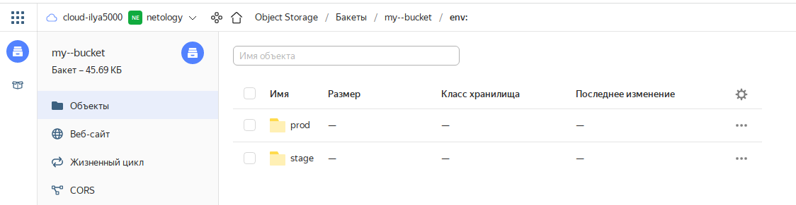

# Домашнее задание к занятию "7.3. Основы и принцип работы Терраформ"

## Задача 1. Создадим бэкэнд в S3 (необязательно, но крайне желательно).

Если в рамках предыдущего задания у вас уже есть аккаунт AWS, то давайте продолжим знакомство со взаимодействием
терраформа и aws. 

1. Создайте s3 бакет, iam роль и пользователя от которого будет работать терраформ. Можно создать отдельного пользователя,
а можно использовать созданного в рамках предыдущего задания, просто добавьте ему необходимы права, как описано 
[здесь](https://www.terraform.io/docs/backends/types/s3.html).

<p align="center">
  
</p>


2. Зарегистрируйте бэкэнд в терраформ проекте как описано по ссылке выше. 
```
terraform {
  required_providers {
    yandex = {
      source = "yandex-cloud/yandex"
    }
  }
  required_version = ">= 0.75"


  backend "s3" {
    endpoint   = "storage.yandexcloud.net"
    bucket     = "my--bucket"
    region     = "ru-central1"
    key        = "terraform/terraform.tfstate"
    access_key = "YC"
    secret_key = "YC"

    skip_region_validation      = true
    skip_credentials_validation = true

}

```


## Задача 2. Инициализируем проект и создаем воркспейсы. 

1. Выполните `terraform init`:
    * если был создан бэкэнд в S3, то терраформ создат файл стейтов в S3 и запись в таблице 
dynamodb.
    * иначе будет создан локальный файл со стейтами.  
 ```
 ilya@lubuntu:~/My_Projects/dz_7_3$ terraform init

Initializing the backend...

Initializing provider plugins...
- Reusing previous version of yandex-cloud/yandex from the dependency lock file
- Using previously-installed yandex-cloud/yandex v0.75.0

Terraform has been successfully initialized!

You may now begin working with Terraform. Try running "terraform plan" to see
any changes that are required for your infrastructure. All Terraform commands
should now work.

If you ever set or change modules or backend configuration for Terraform,
rerun this command to reinitialize your working directory. If you forget, other
commands will detect it and remind you to do so if necessary.
 ```
 
 
2. Создайте два воркспейса `stage` и `prod`.
```
terraform workspace new stage
terraform workspace new prod

```


В уже созданный `aws_instance` добавьте зависимость типа инстанса от вокспейса, что бы в разных ворскспейсах 
использовались разные `instance_type`.
Добавим `count`. Для `stage` должен создаться один экземпляр `ec2`, а для `prod` два. 

```
Добавил в main.tf:

locals {
  instance_count = {
    stage = 1
    prod = 2
    default = 2
  }
}

resource "yandex_compute_instance" "node" {
  

  count = local.instance_count[terraform.workspace]
  
  name                      = "node${count.index + 1}"
  zone                      = "ru-central1-a"
  hostname                  = "node${count.index + 1}.netology.cloud"
  allow_stopping_for_update = true


```


Создайте рядом еще один `aws_instance`, но теперь определите их количество при помощи `for_each`, а не `count`.

```
Создал main1.tf

locals {
  instance_count_for_each = {
    stage = ["vm-1"]
    prod = ["vm-1", "vm-2"]
      }
}

resource "yandex_compute_instance" "node_for_each" {
for_each   =  toset(local.instance_count_for_each[terraform.workspace])
  name       = "node-for-each-${each.value}-${terraform.workspace}"
  zone                      = "ru-central1-a"
  hostname                  = "node_for_each_${each.value}-${terraform.workspace}.netology.cloud"
  allow_stopping_for_update = true

  resources {
    cores  = 2
    memory = 2
  }


```


Что бы при изменении типа инстанса не возникло ситуации, когда не будет ни одного инстанса добавьте параметр
жизненного цикла `create_before_destroy = true` в один из рессурсов `aws_instance`.
```
lifecycle {
    create_before_destroy = true

  }
```
При желании поэкспериментируйте с другими параметрами и рессурсами.
В виде результата работы пришлите:
* Вывод команды `terraform workspace list`.

```
terraform workspace list
  default
* prod
  stage
```


* Вывод команды `terraform plan` для воркспейса `prod`.

```

Terraform used the selected providers to generate the following execution
plan. Resource actions are indicated with the following symbols:
  + create

Terraform will perform the following actions:

  # yandex_compute_instance.node[0] will be created
  + resource "yandex_compute_instance" "node" {
      + allow_stopping_for_update = true
      + created_at                = (known after apply)
      + description               = "prod"
      + folder_id                 = (known after apply)
      + fqdn                      = (known after apply)
      + hostname                  = "node-vm-1-prod.netology.cloud"
      + id                        = (known after apply)
      + metadata                  = {
          + "ssh-keys" = <<-EOT
                centos:ssh-rsa AAAAB
            EOT
        }
      + name                      = "node-vm-1-prod"
      + network_acceleration_type = "standard"
      + platform_id               = "standard-v1"
      + service_account_id        = (known after apply)
      + status                    = (known after apply)
      + zone                      = "ru-central1-a"

      + boot_disk {
          + auto_delete = true
          + device_name = (known after apply)
          + disk_id     = (known after apply)
          + mode        = (known after apply)

          + initialize_params {
              + block_size  = (known after apply)
              + description = (known after apply)
              + image_id    = "fd88d14a6790do254kj7"
              + name        = "root-node1"
              + size        = 20
              + snapshot_id = (known after apply)
              + type        = "network-nvme"
            }
        }

      + network_interface {
          + index              = (known after apply)
          + ip_address         = (known after apply)
          + ipv4               = true
          + ipv6               = (known after apply)
          + ipv6_address       = (known after apply)
          + mac_address        = (known after apply)
          + nat                = true
          + nat_ip_address     = (known after apply)
          + nat_ip_version     = (known after apply)
          + security_group_ids = (known after apply)
          + subnet_id          = (known after apply)
        }

      + placement_policy {
          + host_affinity_rules = (known after apply)
          + placement_group_id  = (known after apply)
        }

      + resources {
          + core_fraction = 100
          + cores         = 2
          + memory        = 2
        }

      + scheduling_policy {
          + preemptible = (known after apply)
        }
    }

  # yandex_compute_instance.node[1] will be created
  + resource "yandex_compute_instance" "node" {
      + allow_stopping_for_update = true
      + created_at                = (known after apply)
      + description               = "prod"
      + folder_id                 = (known after apply)
      + fqdn                      = (known after apply)
      + hostname                  = "node-vm-2-prod.netology.cloud"
      + id                        = (known after apply)
      + metadata                  = {
          + "ssh-keys" = <<-EOT
                centos:ssh-rsa AAAAB
            EOT
        }
      + name                      = "node-vm-2-prod"
      + network_acceleration_type = "standard"
      + platform_id               = "standard-v1"
      + service_account_id        = (known after apply)
      + status                    = (known after apply)
      + zone                      = "ru-central1-a"

      + boot_disk {
          + auto_delete = true
          + device_name = (known after apply)
          + disk_id     = (known after apply)
          + mode        = (known after apply)

          + initialize_params {
              + block_size  = (known after apply)
              + description = (known after apply)
              + image_id    = "fd88d14a6790do254kj7"
              + name        = "root-node2"
              + size        = 20
              + snapshot_id = (known after apply)
              + type        = "network-nvme"
            }
        }

      + network_interface {
          + index              = (known after apply)
          + ip_address         = (known after apply)
          + ipv4               = true
          + ipv6               = (known after apply)
          + ipv6_address       = (known after apply)
          + mac_address        = (known after apply)
          + nat                = true
          + nat_ip_address     = (known after apply)
          + nat_ip_version     = (known after apply)
          + security_group_ids = (known after apply)
          + subnet_id          = (known after apply)
        }

      + placement_policy {
          + host_affinity_rules = (known after apply)
          + placement_group_id  = (known after apply)
        }

      + resources {
          + core_fraction = 100
          + cores         = 2
          + memory        = 2
        }

      + scheduling_policy {
          + preemptible = (known after apply)
        }
    }

  # yandex_compute_instance.node_for_each["vm-1"] will be created
  + resource "yandex_compute_instance" "node_for_each" {
      + allow_stopping_for_update = true
      + created_at                = (known after apply)
      + description               = "node_for_each_prod"
      + folder_id                 = (known after apply)
      + fqdn                      = (known after apply)
      + hostname                  = "node_for_each_vm-1-prod.netology.cloud"
      + id                        = (known after apply)
      + metadata                  = {
          + "ssh-keys" = <<-EOT
                centos:ssh-rsa AAAAB
            EOT
        }
      + name                      = "node-for-each-vm-1-prod"
      + network_acceleration_type = "standard"
      + platform_id               = "standard-v1"
      + service_account_id        = (known after apply)
      + status                    = (known after apply)
      + zone                      = "ru-central1-a"

      + boot_disk {
          + auto_delete = true
          + device_name = (known after apply)
          + disk_id     = (known after apply)
          + mode        = (known after apply)

          + initialize_params {
              + block_size  = (known after apply)
              + description = (known after apply)
              + image_id    = "fd88d14a6790do254kj7"
              + name        = "root-node-vm-1"
              + size        = 20
              + snapshot_id = (known after apply)
              + type        = "network-nvme"
            }
        }

      + network_interface {
          + index              = (known after apply)
          + ip_address         = (known after apply)
          + ipv4               = true
          + ipv6               = (known after apply)
          + ipv6_address       = (known after apply)
          + mac_address        = (known after apply)
          + nat                = true
          + nat_ip_address     = (known after apply)
          + nat_ip_version     = (known after apply)
          + security_group_ids = (known after apply)
          + subnet_id          = (known after apply)
        }

      + placement_policy {
          + host_affinity_rules = (known after apply)
          + placement_group_id  = (known after apply)
        }

      + resources {
          + core_fraction = 100
          + cores         = 2
          + memory        = 2
        }

      + scheduling_policy {
          + preemptible = (known after apply)
        }
    }

  # yandex_compute_instance.node_for_each["vm-2"] will be created
  + resource "yandex_compute_instance" "node_for_each" {
      + allow_stopping_for_update = true
      + created_at                = (known after apply)
      + description               = "node_for_each_prod"
      + folder_id                 = (known after apply)
      + fqdn                      = (known after apply)
      + hostname                  = "node_for_each_vm-2-prod.netology.cloud"
      + id                        = (known after apply)
      + metadata                  = {
          + "ssh-keys" = <<-EOT
                centos:ssh-rsa AAAAB
            EOT
        }
      + name                      = "node-for-each-vm-2-prod"
      + network_acceleration_type = "standard"
      + platform_id               = "standard-v1"
      + service_account_id        = (known after apply)
      + status                    = (known after apply)
      + zone                      = "ru-central1-a"

      + boot_disk {
          + auto_delete = true
          + device_name = (known after apply)
          + disk_id     = (known after apply)
          + mode        = (known after apply)

          + initialize_params {
              + block_size  = (known after apply)
              + description = (known after apply)
              + image_id    = "fd88d14a6790do254kj7"
              + name        = "root-node-vm-2"
              + size        = 20
              + snapshot_id = (known after apply)
              + type        = "network-nvme"
            }
        }

      + network_interface {
          + index              = (known after apply)
          + ip_address         = (known after apply)
          + ipv4               = true
          + ipv6               = (known after apply)
          + ipv6_address       = (known after apply)
          + mac_address        = (known after apply)
          + nat                = true
          + nat_ip_address     = (known after apply)
          + nat_ip_version     = (known after apply)
          + security_group_ids = (known after apply)
          + subnet_id          = (known after apply)
        }

      + placement_policy {
          + host_affinity_rules = (known after apply)
          + placement_group_id  = (known after apply)
        }

      + resources {
          + core_fraction = 100
          + cores         = 2
          + memory        = 2
        }

      + scheduling_policy {
          + preemptible = (known after apply)
        }
    }

  # yandex_vpc_network.default will be created
  + resource "yandex_vpc_network" "default" {
      + created_at                = (known after apply)
      + default_security_group_id = (known after apply)
      + folder_id                 = (known after apply)
      + id                        = (known after apply)
      + labels                    = (known after apply)
      + name                      = "net"
      + subnet_ids                = (known after apply)
    }

  # yandex_vpc_subnet.default will be created
  + resource "yandex_vpc_subnet" "default" {
      + created_at     = (known after apply)
      + folder_id      = (known after apply)
      + id             = (known after apply)
      + labels         = (known after apply)
      + name           = "subnet"
      + network_id     = (known after apply)
      + v4_cidr_blocks = [
          + "192.168.101.0/24",
        ]
      + v6_cidr_blocks = (known after apply)
      + zone           = "ru-central1-a"
    }

Plan: 6 to add, 0 to change, 0 to destroy.

Changes to Outputs:
  + external_ip_address_node01_yandex_cloud        = {
      + node-vm-1-prod = (known after apply)
      + node-vm-2-prod = (known after apply)
    }
  + external_ip_address_node_for_each_yandex_cloud = {
      + node-for-each-vm-1-prod = (known after apply)
      + node-for-each-vm-2-prod = (known after apply)
    }
  + internal_ip_address_node01_yandex_cloud        = {
      + node-vm-1-prod = (known after apply)
      + node-vm-2-prod = (known after apply)
    }
  + internal_ip_address_node_for_each_yandex_cloud = {
      + node-for-each-vm-1-prod = (known after apply)
      + node-for-each-vm-2-prod = (known after apply)
    }
  + s_id                                           = (known after apply)
  + subnet_id                                      = {
      + node-vm-1-prod = (known after apply)
      + node-vm-2-prod = (known after apply)
    }
  + tf_workspace                                   = "prod"
  + zone                                           = "ru-central1-a"

─────────────────────────────────────────────────────────────────────────────

Note: You didn't use the -out option to save this plan, so Terraform can't
guarantee to take exactly these actions if you run "terraform apply" now.

```

